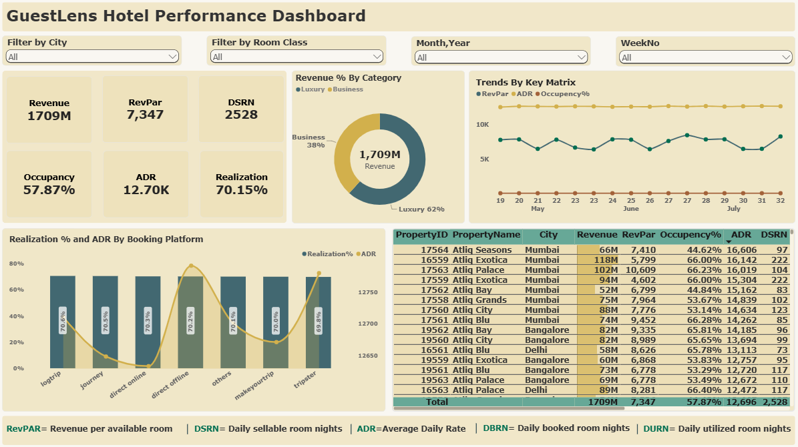

# GuestLens: Hospitality Performance Analytics (Power BI)

An end-to-end Power BI project analysing revenue, occupancy and booking performance for **GuestLens**, a fictional hotel chain with luxury and business hotels across India.



---

## Overview

GuestLens operates 7 properties across 4 Indian cities and has been losing market share and revenue in the luxury/business hotel category. This project turns raw booking data into a dashboard that helps management see where revenue comes from, which properties and channels perform best, and where occupancy is falling short.

The project is based on a challenge by **Codebasics**. The data model, DAX measures and dashboard design in this repo are my own implementation.

## Objectives

1. Build the key hospitality metrics from the data provided.
2. Design an interactive dashboard that answers stakeholder questions.
3. Draw out business insights that support better management decisions.

## Business Context

| Item | Detail |
|---|---|
| Hotel chain | GuestLens |
| Properties | 7 across 4 cities |
| Room classes | Standard, Elite, Premium, Presidential |
| Categories | Luxury and Business |
| Booking platforms | logtrip, journey, direct online, direct offline, makeyourtrip, tripster, others |
| Analysis period | May to July (weeks 19 to 32) |

## Data Model

| Table | Description |
|---|---|
| `dim_date` | Dates, week numbers, day type (weekday/weekend) |
| `dim_hotels` | Property ID, name, category, city |
| `dim_rooms` | Room ID and room class |
| `fact_bookings` | Booking-level data: dates, guests, room category, platform, ratings, status, revenue |
| `fact_aggregated_bookings` | Property ID, check-in date, room category, successful bookings, capacity |

## Key Metrics (DAX)

| Metric | Meaning |
|---|---|
| **Revenue** | Total revenue earned (realised + cancelled bookings) |
| **RevPAR** | Revenue per available room |
| **ADR** | Average daily rate |
| **Occupancy %** | Successful bookings divided by capacity |
| **Realization %** | Share of bookings that were not cancelled |
| **DSRN** | Daily sellable room nights |
| **DBRN** | Daily booked room nights |
| **DURN** | Daily utilised room nights |
| **WoW change** | Week-on-week change in key metrics |

## Dashboard Features

- **KPI cards** for Revenue, RevPAR, DSRN, Occupancy, ADR and Realization
- **Revenue by category** donut chart (Luxury vs Business)
- **Trend chart** of RevPAR, ADR, and Occupancy by week
- **Booking platform view** comparing Realization % and ADR
- **Property table** with Revenue, RevPAR, Occupancy, ADR and DSRN for every property
- **Slicers** for City, Room Class, Month/Year and Week Number

## Headline Numbers

| Revenue | RevPAR | Occupancy | ADR | Realization | DSRN |
|---|---|---|---|---|---|
| 1,709M | 7,347 | 57.87% | 12.70K | 70.15% | 2,528 |

## Key Insights

> Please double-check each number against your own dashboard before publishing.

1. **Luxury drives revenue.** Luxury hotels bring in about 62% of total revenue, with Business at 38%.
2. **Mumbai leads.** Mumbai properties dominate the top of the revenue and ADR rankings, with Atliq Exotica and Atliq Palace the biggest earners.
3. **Occupancy is a weak spot.** Overall occupancy is 57.87%, and some properties (for example, Atliq Seasons and Atliq Bay in Mumbai) sit below 45%, leaving a lot of unsold capacity.
4. **Realization is similar across platforms.** Every booking platform sits close to 70%, so cancellations look like a chain-wide issue and not a problem with one channel.
5. **ADR varies more by platform than realization does.** Some channels earn a noticeably higher average rate, which suggests where to focus partnerships and pricing.
6. **Trends are stable.** ADR stays almost flat from May to July, while RevPAR moves with occupancy.

## Recommendations

- Run targeted offers or packages at low-occupancy properties to lift occupancy.
- Investigate cancellation reasons, since about 30% of bookings do not convert to revenue.
- Push higher-ADR booking channels and review commission costs against rate.
- Compare weekday and weekend performance to adjust pricing.

## Tools Used

- Power BI Desktop (data modelling, DAX, visuals)
- Power Query (data cleaning)
- Excel / CSV (source data)

## Repository Structure

```
├── README.md
├── images/
│   └── dashboard.png
├── data/
│   ├── dim_date.csv
│   ├── dim_hotels.csv
│   ├── dim_rooms.csv
│   ├── fact_bookings.csv
│   └── fact_aggregated_bookings.csv
└── GuestLens_Dashboard.pbix
```

## Acknowledgments

- Codebasics, for the challenge, dataset, and problem statement.

## Connect With Me

- LinkedIn: [Ashutosh Bhardwaj]((https://www.linkedin.com/in/ashu-bhardwaj555))

Thank you for visiting!
